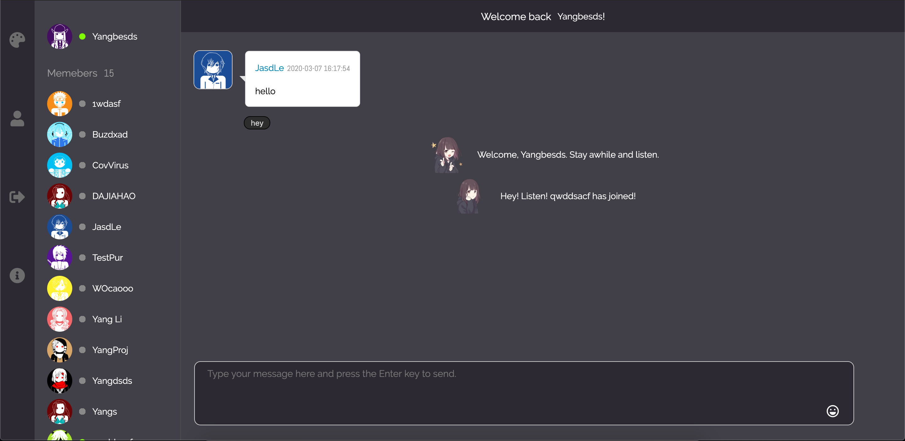
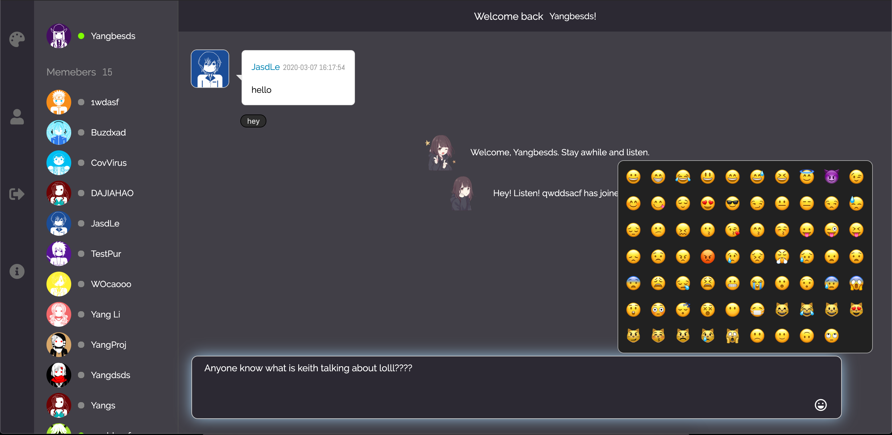
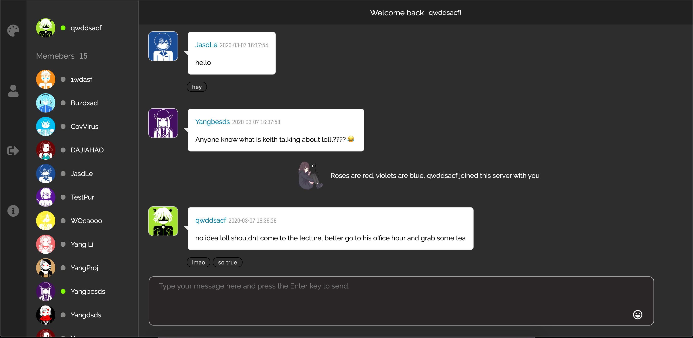
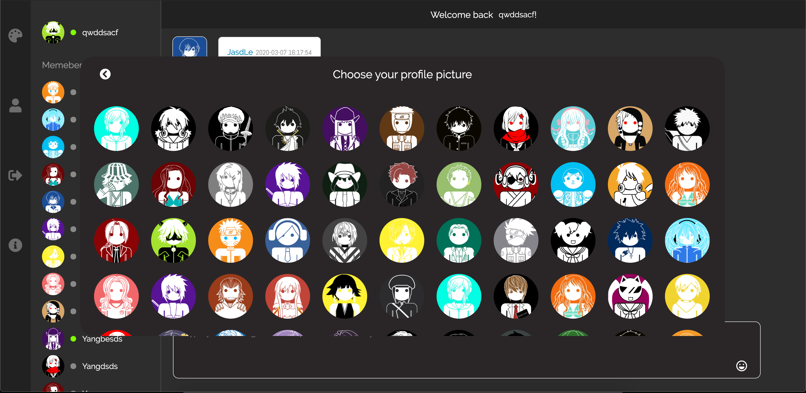
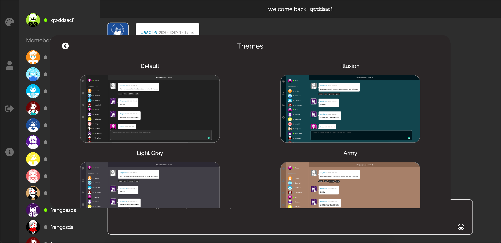
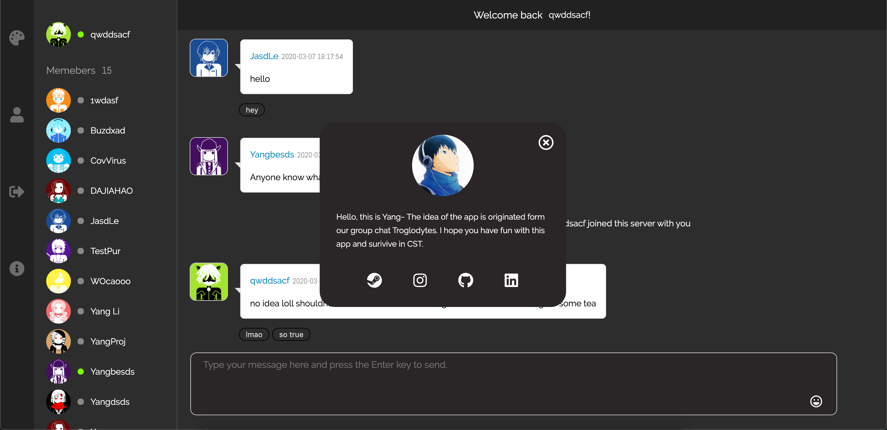

# Dollars

## What is Dollars?

Troglodytes is an online web chat app that allows you and your friends chatting and have fun! The idea is inspired by Animation Durarara!!. The chatting room in Durarara!! is anonymous which means each user's account name is not real, and no one knows each other. There is no user verification in that chatting room, so user could login and talk on the go. 

Also while I was studying in BCIT CST, we had a slack channel called Troglodytes. Basically we talk and chill in the group channel. I made the app mainly for fun (lol) and practice database manipulation skills.

## Screenshot

<i style="font-size: 13px">Welcome message when user join the room</i>

<i style="font-size: 13px">Emoji</i>

<i style="font-size: 13px">Tag the chat</i>

<i style="font-size: 13px">Durarara style profile picture</i>

<i style="font-size: 13px">Custom theme</i>

<i style="font-size: 13px">Auto information</i>

## Feature
- Change profile picture with built-in Durarara style images
- Chatting with other people with real time database update
- Choose the app color theme 
- Set your own color theme by choosing the primary and secondary color
- Add tags to chat contents anonymously
- Online/Offline status for memebers
- Welcome message when users join the room
- Built-in emoji package
- Cloud store and update of all your chatting, theme, profile information
- Tips modal if user input empty values

## Tools
- HTML5/CSS3/Javascript/jQuery
- Firebase

## Change Log
### v0.0.0 (2020/03/07 16:32) First deploy
- First release version deploy to firebase